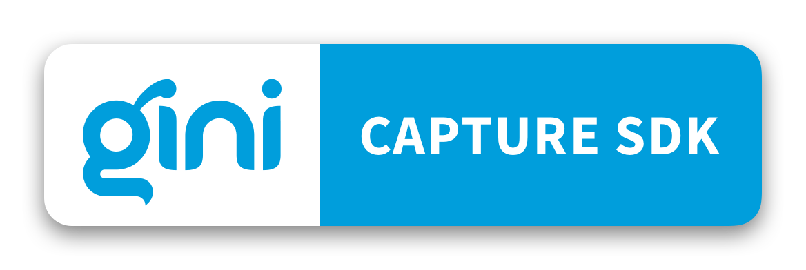

# Gini Capture SDK Pinning for iOS

The Gini Capture SDK Pinning provides components for capturing, reviewing and analyzing photos of invoices and remittance slips. The sdk supports certificate pinning.

By integrating this SDK into your application you can allow your users to easily take a picture of a document, review it and getting analysis results from the Gini backend.

We provide pre-defined screens that can be customized in a limited way. The screen and configuration design is based on our long-lasting experience with integration in customer apps.

On *iPhone*, the Gini Capture SDK has been designed for portrait orientation.
On *iPad* we support portrait and landscape orientations.

## Documentation

Further documentation with installation, integration or customization guides can be found in our [website](https://developer.gini.net/gini-mobile-ios/GiniCaptureSDK/).

## Requirements

- iOS 12+
- Xcode 12+

**Note:**
In order to have better analysis results it is highly recommended to enable only devices with 8MP camera and flash. These devices would be:

* iPhones with iOS 12 or higher.
* iPad Pro devices (iPad Air 2 and iPad Mini 4 have 8MP camera but no flash).

## Author

Gini GmbH, hello@gini.net

## License

The Gini Capture SDK Pinning for iOS is licensed under a Private License. See [the license](https://developer.gini.net/gini-mobile-ios/GiniCaptureSDK/license.html) for more info.

**Important:** Always make sure to ship all license notices and permissions with your application.
